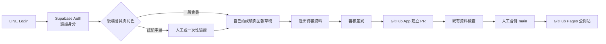

# LINE 後台會員制：低成本安全方案評估

## 任務狀態

- 日期：2026-10-06
- 工作位置：`opendebate-line-admin-plan`
- 分支：`codex/line-admin-plan`
- 起點：`main` 的 `2befa88`
- 本階段只做架構、費用與風險評估，不建立 LINE Channel、不開雲端帳號、不更動公開網站。
- 另一個工作樹可繼續進行全站實機與無障礙檢修；本分支日後整合前，應先取得最新 `main`，處理可能的新提交後再做一次集中驗證。

## 結論

可以做，而且 LINE Login 本身免費。依維護者進一步確認，目標是讓每位使用者都能選擇登入，在自己的會員區保存成績、申請連結公開選手紀錄，並把新資料送入待審區；公開查詢仍不強迫登入。

建議架構是：

1. 公開網站繼續放在 GitHub Pages，任何人都不需要登入，現有公開查詢與部署不受後台故障影響。
2. 在同一網站加入會員區，使用 **LINE Login + Supabase Custom OIDC** 驗證同一個 LINE 帳號再次回來。
3. 一般會員只能讀寫自己的私人比分、成績筆記與回報草稿；資料庫在每一筆資料檢查擁有者。
4. 會員可申請認領公開選手頁，但 LINE 登入本身不能證明真實姓名，必須經人工或一次性驗證後才連結。
5. 會員送出的賽事、比分、名單與來源先進入待審區，不會直接改公開資料。
6. 審核通過後才由後台建立 GitHub PR，經資料檢查及人工確認後合併，不直接寫入 `main`。
7. 公開賽事 CSV 與 Git 歷史仍是正式資料來源；會員資料庫保存最少帳號識別、私人紀錄、待審回報、附件索引與操作紀錄。

這個選擇的理由不是 Supabase 絕對不會出事，而是它可代管 OAuth/OIDC 流程、工作階段、資料庫與逐列權限，減少自行撰寫登入安全程式的範圍。LINE 官方明確要求每次登入使用隨機 `state`、核對 `nonce`、驗證 ID token，並支援 PKCE；交由成熟身分服務處理，比自行拼裝較不容易漏掉其中一項。

## 建議的權限模型

LINE Login 只回答「這是哪一個 LINE 帳號」，不回答「這個人可以發布什麼」。後台仍須在每一次讀取、修改與發布時檢查角色。

| 角色 | 可做的事 | 不可做的事 |
| --- | --- | --- |
| 一般會員 | 保存、修改、刪除自己的私人紀錄；提交待審資料 | 看別人的私人紀錄、改公開資料、發布 |
| 已驗證選手 | 一般會員功能；把已確認的公開選手頁連到自己的帳號 | 自行認領別人、改寫歷史賽果 |
| 審核者 | 檢查來源與差異、退回回報、核准建立 PR | 略過資料檢查、直接推送 `main` |
| 管理者 | 管理停權、身分認領與審核者權限、處理事故 | 單憑隱藏按鈕繞過後端權限 |

初期只有一位維護者時，管理者與審核者可以是同一帳號；但發布動作仍應再次確認，留下不可由操作者修改的紀錄。日後教練增加，再把審核與管理分開。

帳號應綁定 LINE 驗證後的 `sub`（此 Login Channel 下的穩定使用者 ID），不要拿顯示名稱當帳號。LINE 顯示名稱可以重複或更改；電子郵件也不是必然提供。任何人可建立一般會員帳號，但審核者與管理者只能由現有管理者授予；不能讓第一個登入者或一般會員自行升級。

LINE Login 能確認「這次登入與上次是同一個 LINE 帳號」，不能自行確認這個人就是公開資料中的某位辯手。私人建檔不需要真名；只有認領公開選手頁時才要求額外驗證，例如既有名單可核對的資料、教練核准或管理者提供的一次性認領碼。

## 建議資料流

後台若停止或 Supabase 暫停，公開站仍照常運作。GitHub PR 與版本歷史也能提供第二條復原路徑。

## 費用比較（2026-10-06 官方公開價格）

| 方案 | 小規模費用 | 優點 | 主要代價 |
| --- | --- | --- | --- |
| Supabase Free + LINE OIDC | LINE Login 0 美元；Supabase 0 美元／月 | 身分驗證、Postgres、RLS、Storage 都有現成功能；Free 含 50,000 MAU、500 MB DB、1 GB 檔案 | 一週無活動會暫停；沒有自動備份；Auth audit log 僅 1 小時；沒有可設定的工作階段逾時 |
| Supabase Pro + LINE OIDC | 25 美元／月起 | 不會因閒置暫停；7 日每日備份與 7 日 log；可設定單一工作階段與逾時；預設有 spend cap | 固定月費；點時間復原另計；仍須正確寫 RLS 與應用權限 |
| Cloudflare Workers + D1 + R2 | 用量小可 0 美元；Workers Paid 最低 5 美元／月 | 免費額度大、D1 Free 有 7 日 Time Travel、R2 適合附件 | LINE callback、session、權限與 token 驗證需自行實作；工程錯誤風險較高。Free 超額會暫停查詢或回錯誤 |
| Firebase Identity Platform OIDC | OIDC 每月前 50 MAU 免費，超出依 MAU 計價 | Google 代管身分與資料服務 | LINE 不是原生按鈕，仍需 OIDC 設定；Storage 需 Blaze 計費方案，費用與元件較分散 |

### 實際建議

- **公開測試期**：Supabase Free，開放一般會員登入與私人紀錄，但限制附件容量；正式資料仍靠待審與 GitHub PR，另做每日可恢復匯出。若月活躍會員、資料量與儲存量在免費額度內，平台費用可為 0 美元／月。
- **開始依賴後台工作後**：升 Supabase Pro，預估 25 美元／月。它不是「花錢就安全」，但備份、紀錄與工作階段控制比較符合正式使用。
- **不建議第一版採 Cloudflare 自製登入**：月費可能較低，但省下的費用會轉成登入與 session 程式的維護責任。若日後已有熟悉 OAuth 的維護者，再評估搬移。

價格會變動；上表不含網域、第三方郵件、影像掃描或大量流量。Supabase Pro 的 spend cap 預設開啟，正式啟用前仍要確認各雲端帳號的預算警示。

## 既有網域、GitHub Pages 與 ChatGPT Sites

網域不必綁死在 GitHub。自有網域可以依 DNS 分流：

- `www.你的網域` 或根網域：維持公司的官方網站。
- `debate.你的網域`：公開辯論資訊網，以及登入後才顯示的個人會員區。

GitHub Pages 免費方案支援公開 repository 的自訂根網域、`www` 及其他子網域，因此目前公開站可以直接使用既有官網網域，不必因為網址而搬家。設定前應先在 GitHub 驗證網域，避免 DNS 殘留造成子網域接管風險。

ChatGPT Sites 也可在帳號提供該功能時連接既有自訂網域，但它目前是 public beta：使用量包含在符合資格的 ChatGPT workspace、Plus 或 Pro 方案額度內，額度因方案而異且可能調整；Free、Go 不提供 Sites。這不能視為永久、無上限的免費主機。

Sites 可以保存 D1／R2 資料，也能使用 ChatGPT 登入或 workspace 身分保護頁面；但目前支援流程沒有保證可直接把 LINE 當作 Site 的外部登入供應者。若 LINE Login 是必要條件，仍需另外確認外部 OAuth 路徑或保留 Supabase 等登入後端。單純把網站搬到 Sites，不會自動解決 LINE 白名單、角色與發布權限。

目前較穩妥的安排是保留既有 GitHub Pages 資料與部署流程，把 `debate` 子網域指向公開站；會員登入後在同一站內進入自己的會員區。公司原本使用的根網域與 `www` 不需要移動。若日後確定不需要 LINE、願意改用 ChatGPT 登入，才值得把「整站改由 Sites 託管」列為正式候選；搬移時仍要保留既有 CSV、生成檢查、Git 歷史與 PR 審核能力。

## 最糟的代價

### 1. 管理帳號被接管

攻擊者可以竄改賽果、冒名發布、植入惡意連結，甚至刪除草稿。若後台持有可直接推送 `main` 的長效 GitHub token，事故會立刻擴大到整個公開站。

降低方式：後台只可用私有 GitHub App 建立功能分支與 PR；GitHub App 只安裝在這一個 repository，使用一小時到期的 installation token；保護 `main`，要求 PR 與資料檢查，不給後台刪除 repository、改設定或繞過規則的權限。

### 2. 會員、草稿或照片外洩

LINE 使用者 ID、顯示名稱、操作紀錄、未公開照片及草稿可能一起外洩。高中生照片與名單尤其容易造成當事人困擾；若蒐集更多會員資料，還會增加事故通知、刪除請求及法律處理成本。

降低方式：第一版只收 LINE `sub`、必要顯示名稱、角色與操作時間；不索取生日、電話、學校或 LINE 好友資料。附件預設私有，限制副檔名、實際檔案型別、大小與數量，重新命名後保存；公開前人工確認。不把 LINE access token 或後台 session 放進 `localStorage`。

### 3. 備份一起被刪或復原不了

若正式資料、草稿與備份都在同一管理平面，管理者帳號被接管時可能一起失去。Supabase Free 沒有自動資料庫備份，不能把「在雲端」當成備份。

降低方式：公開資料持續保留 Git 歷史；草稿每日匯出到另一個儲存位置；附件保留版本或物件鎖定策略；每季實際做一次還原演練。升 Pro 後仍保留異地匯出。

### 4. 法律與信任成本

台灣個人資料保護規範要求保有個資者採適當安全措施；知悉資料遭竊取、竄改、毀損、滅失或洩漏時，原則上要通知當事人。最壞情況通常不只是雲端帳單，而是通知受影響者、調查事件、重建資料、停站、法律責任與社群信任損失。若學生也能註冊，事故範圍和隱私義務都會大幅上升。

因此第一版雖可開放學生與一般使用者成為會員，仍不追蹤未登入訪客，也不蒐集生日、電話、住址、學校班級或 LINE 好友資料。會員必須能刪除自己的私人紀錄並申請刪除帳號；公開賽果與歷史紀錄則依公開資料更正流程處理，不能因帳號刪除而任意抹去公開史料。

## 必須落實的安全底線

1. 登入採 OIDC authorization code + PKCE；驗證 `state`、`nonce`、issuer、audience、有效期與簽章。
2. LINE Channel secret、Supabase service key、GitHub App private key 只能放雲端 secret manager，不進 Git、不進前端 JavaScript。
3. 瀏覽器 session 使用 `HttpOnly`、`Secure`、適當 `SameSite` cookie；後端設定閒置與絕對逾時，登出與停權要能立即失效。
4. 所有資料表先啟用 RLS，再逐條開放；沒有符合規則時一律拒絕。service role 只允許後端使用。
5. 每個修改 API 都由後端重新查角色，不信任前端傳來的 `role`、LINE 名稱或「按鈕是否顯示」。
6. 登入、權限變更、草稿修改、附件下載、核准與發布都留 audit log；操作者不能刪自己的紀錄。
7. 限制登入及敏感操作速率；權限變更與發布要重新驗證近期 session。
8. 發布只建立 PR；`main` 不接受後台直接 push。既有資料預檢與生成檔一致性檢查必須通過。
9. 建立緊急停用：可立即停用某位成員、撤銷 GitHub App、輪替 secrets、關閉後台而不影響公開站。
10. 上線前做一次權限測試：一般會員、已驗證選手、審核者、管理者與停權者不能互相越權；用不同帳號測試，不能只測自己的管理員帳號。

## 建置順序

### 第一階段：會員登入與私人紀錄，不碰正式資料

- 建立 LINE Login Channel 與獨立 Supabase 測試專案。
- 設定 Custom OIDC，scope 只取 `openid profile`，不要求 email。
- 建立 `members`、私人紀錄與 RLS；新登入者是一般會員。
- 先提供自己的成績建檔、匯出、帳號刪除與登出；不能查看他人資料，也不能改公開資料。

### 第二階段：回報待審與選手認領

- 依現有賽事登錄模板建立結構化草稿。
- 加入欄位驗證、來源、版本、差異與 audit log。
- 建立公開選手頁認領申請；通過前不顯示會員身分，也不賦予修改公開紀錄的能力。
- 照片放私人 bucket；未公開附件使用短效簽名 URL。
- 每日匯出草稿、認領狀態與必要會員資料的可恢復備份。

### 第三階段：安全發布

- 建立只限本 repository 的 private GitHub App。
- 後台把草稿轉成賽事來源檔，在新分支建立 PR。
- 沿用 `build_data.py --check --fail-on-warnings`、生成檔一致性及現有測試。
- 只有審核者可提出發布；實際合併仍在 GitHub 完成。

### 第四階段：AI／Dot 協作

- AI 不共用你的 LINE session，也不取得 LINE Channel secret。
- 另發短效、可撤銷、範圍受限的服務憑證；預設只能建立草稿，不能發布。
- 每筆 AI 修改保存來源、輸入摘要、差異與操作者，仍經人工核准建立 PR。

## 尚未做的事

- 尚未建立 Supabase、Cloudflare、Firebase 或 LINE Developers 資源。
- 尚未驗證 LINE 與 Supabase Custom OIDC 的實際 callback；文件層面相容，但上線前必須用測試 Channel 做端到端驗證。
- 尚未決定正式後台網域、實際會員與角色名單、照片保存期限及草稿備份位置。
- 尚未建立 UI 原型或修改公開網站。

## 官方資料來源

- LINE Login 概覽與免費說明：<https://developers.line.biz/en/docs/line-login/overview/>
- LINE 網頁登入、OIDC、PKCE、state 與 nonce：<https://developers.line.biz/en/docs/line-login/integrate-line-login/>
- LINE Login 安全檢核表：<https://developers.line.biz/en/docs/line-login/security-checklist/>
- LINE Login v2.1 token／ID token 驗證：<https://developers.line.biz/en/reference/line-login/>
- Supabase Custom OAuth/OIDC Providers：<https://supabase.com/docs/guides/auth/custom-oauth-providers>
- Supabase Auth 與 RLS：<https://supabase.com/docs/guides/auth>、<https://supabase.com/docs/guides/database/postgres/row-level-security>
- Supabase 價格與方案限制：<https://supabase.com/pricing>
- Supabase production checklist：<https://supabase.com/docs/guides/deployment/going-into-prod>
- Cloudflare Workers／D1／R2 價格：<https://developers.cloudflare.com/workers/platform/pricing/>、<https://developers.cloudflare.com/d1/platform/pricing/>、<https://developers.cloudflare.com/r2/pricing/>
- Cloudflare D1 Time Travel：<https://developers.cloudflare.com/d1/reference/time-travel/>
- Firebase OIDC 與價格：<https://firebase.google.com/docs/auth/web/openid-connect>、<https://firebase.google.com/pricing>
- GitHub App 安裝權限與短效 token：<https://docs.github.com/en/apps/using-github-apps/authorizing-github-apps>、<https://docs.github.com/en/rest/apps/apps#generate-an-installation-access-token-for-an-app>
- GitHub rulesets：<https://docs.github.com/en/repositories/configuring-branches-and-merges-in-your-repository/managing-rulesets/available-rules-for-rulesets>
- GitHub Pages 自訂網域：<https://docs.github.com/en/pages/configuring-a-custom-domain-for-your-github-pages-site/about-custom-domains-and-github-pages>
- ChatGPT Sites、方案額度與自訂網域：<https://help.openai.com/en/articles/20001339-creating-and-using-chatgpt-sites>
- OWASP Authorization、Session、File Upload：<https://cheatsheetseries.owasp.org/cheatsheets/Authorization_Cheat_Sheet.html>、<https://cheatsheetseries.owasp.org/cheatsheets/Session_Management_Cheat_Sheet.html>、<https://cheatsheetseries.owasp.org/cheatsheets/File_Upload_Cheat_Sheet.html>
- 個人資料保護法現行條文（個人資料保護委員會籌備處）：<https://law.pdpc.gov.tw/LawContent.aspx?id=FL010627>
